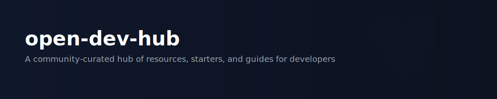

# open-dev-hub — Open Foundry for Developers 🚀

  

A central, community-curated hub of open-source resources, project starters, and learning paths for developers across domains — AI, Web, Cybersecurity, Dev Tools, IoT, and more.

> Open knowledge, better software — built together. ✨

---

## Table of contents
- [Why this project](#why-this-project)
- [Categories](#categories)
- [Quick start (contribute)](#quick-start-contribute)
- [Directory layout](#directory-layout)
- [Maintainers & contact](#maintainers--contact)
- [License](#license)
- [Contributors](#contributors)

---

## Why this project
Finding high-quality, practical resources across many developer domains is time-consuming. This repo gathers curated guides, tutorials, and open-source projects to help beginners learn quickly and experts discover reusable tooling and templates.

---

## Categories
| Area | Summary |
|---|---|
| 🔬 AI & Machine Learning | Datasets, notebooks, model deployment guides, and starter projects |
| 🌐 Web Development | Frontend, backend, fullstack starters and deployment patterns |
| 🛡️ Cybersecurity & CTF | Learning paths, tooling, CTF write-ups and practice platforms |
| ⚙️ Dev Tools & Automation | CI/CD templates, scripts, and automation best-practices |
| 🌱 IoT & Embedded Systems | Microcontroller guides, hardware projects, and tooling |

Jump in:
- ai-ml/README.md
- web-development/README.md
- cybersecurity-ctf/README.md
- dev-tools-automation/README.md
- iot-embedded/README.md

---

## Quick start — contribute in 3 steps
1. Fork this repository.
2. Create a branch named `category/short-description` (e.g. `ai-ml/add-notebook`).
3. Add your resource (README update / tutorial / starter) and open a Pull Request.

Full workflow and expectations: see `CONTRIBUTING.md`.

---

## Directory layout
See `docs/ARCHITECTURE.md` for conventions and where to place different types of content (resources, starters, notebooks, demo apps).

---

## Maintainers & contact
Maintained by the community. For security issues or code of conduct violations, refer to `CODE_OF_CONDUCT.md`.

---

## License
This repository uses the MIT license. See `LICENSE`.

---

## Contributors ✨
We welcome contributions! Add yourself to `CONTRIBUTORS.md` or submit a PR letting us add you.

---

Thank you for visiting — go explore a category and submit a PR to make this hub better!